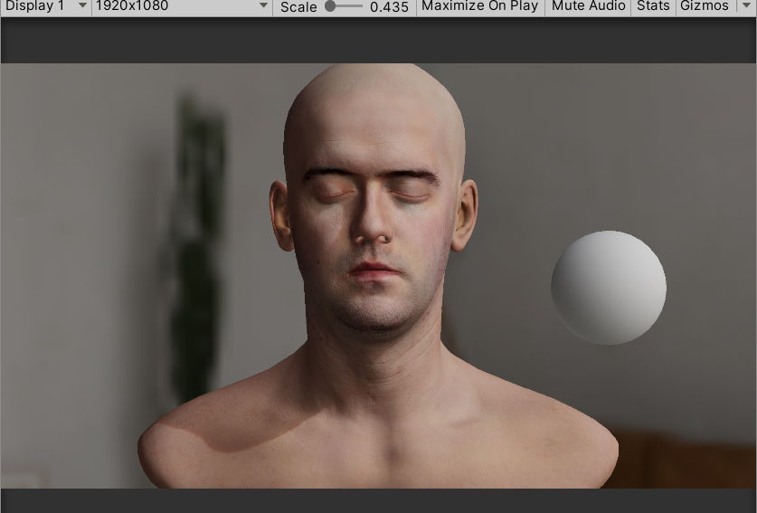

# PreintegratedSubsurfaceScattering

This is a completely PreintegratedSubsurfaceScattering unity solution. Used for skin, if you replace the diffusion profile(need modify some code), it is possible to using for other scatter material.

## Features

- Directional curvature calculate tools
- Indirect light Preintegrated sss lut
- Direct light linear Preintegrated sss lut
- Shadow Preintegrated sss lut

## Usage

Open this project in Unity, Unity version is 2019.4.17f1.

Bake curvature window in **Window/BakeCurvatureWindow**.

Generate preintegrated lut window in **Window/GeneratePreIntegratedTexWindow**.

There are some preintegrated lut in **Assets/Human/Texture/lut**.

this is a example.

## Reference

1. [Penner pre-integrated skin rendering (siggraph 2011 advances in real-time rendering course)](https://www.slideshare.net/leegoonz/penner-preintegrated-skin-rendering-siggraph-2011-advances-in-realtime-rendering-course)
2. GPU Pro 2, Part 2. Rendering, Chapter 1. Pre-Intergrated Skin Shading
3. [Simon's Tech Blog](http://simonstechblog.blogspot.com/2015/02/pre-integrated-skin-shading.html)
4. [GPU Gems 1, Real-Time Approximations to Subsurface Scattering](https://developer.nvidia.com/gpugems/gpugems/part-iii-materials/chapter-16-real-time-approximations-subsurface-scattering)
5. [Ghost of Tsushima](https://blog.selfshadow.com/publications/s2020-shading-course/patry/slides/index.html)
6. [预积分皮肤渲染—次表面散射与高光反射](https://zhuanlan.zhihu.com/p/509057464)
7. [Estimating Curvatures and Their Derivatives on Triangle Meshes](https://geometry.stanford.edu/papers/ng-test1/ng-test1.pdf)
8. [trimesh2](https://github.com/Forceflow/trimesh2)
9. [Crafting a Next-Gen Material Pipeline for The Order: 1886](http://blog.selfshadow.com/publications/s2013-shading-course/rad/s2013_pbs_rad_notes.pdf)
10. [Pre-integrated Skin Shading Under Spherical Harmonic Indirect Lighting](https://dennisruan171085578.wordpress.com/2020/09/06/pre-integrated-skin-shading-under-spherical-harmonic-indirect-lighting/)

## License

This project is licensed under the terms of the **MIT** license.
